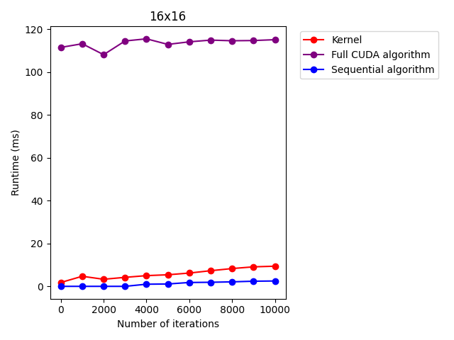
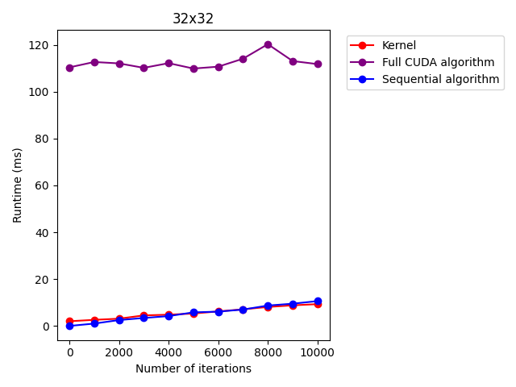
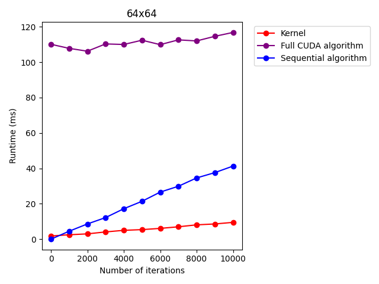
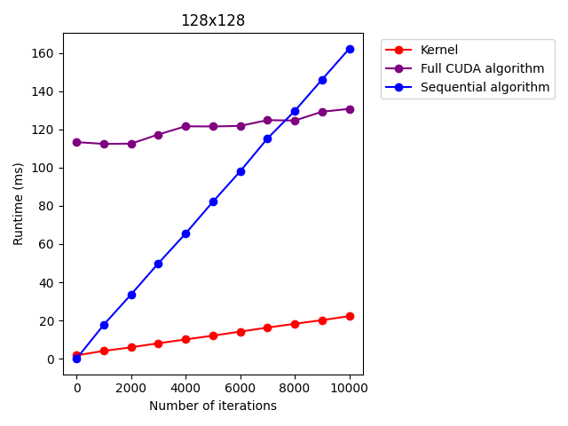
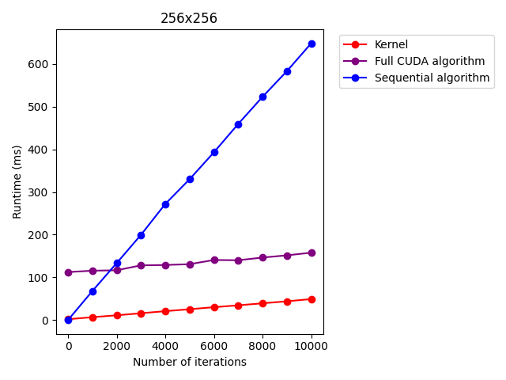

# Benchmarking
Benchmark data in this README is from an Nvidia GTX 1660 SUPER and Intel i7-11700F at 2.50 Hz.

## Benchmark data
The following data from an Nvidia GTX 1660 SUPER and Intel i7-11700F at 2.50 Hz. The benchmark code runs the escape time algorithm for a grid of complex numbers
with real part -1 to 1. The complex part scales starts at -1 and spacing is the same as for the real part. All figures in this doc use a square grid.

CUDA is not the best approach to the escape time algorithm in all scenarios, such as a small grid. This is expected, as the architecture
of a GPU is specifically designed for large amounts of parallel threads. For a small enough grid, such as a 16x16 one, the sequential algorithm even scales better with the number of iterations.



As the size of the grid grows the CUDA algorithm begins to scale better with the number of iterations than the sequential one. Due to the large overhead of allocating, copying, and
freeing CUDA memory however, the sequential algorithm can still be much faster.




Once the grid gets large enough, there is a clear speed advantage for the CUDA algorithm. This advantage is still only in place past a large amount of iterations though. Again, this is due to the
large overhead of setting up, copying, and freeing memory for the CUDA kernel.




Most actual Mandelbrot set visualizations are not going to have a small amount of pixels. Even with a large grid though, the sequential algorithm is more effective for less iterations.
This means that CUDA is faster with finer details, while sequential is better for less detailed visualizations. The CUDA based visualization would allow a user to zoom in further than the sequential visualization
with a large amount of detail and accurate visualization while maintaining speed.

As development on the visualizer continues, there may be more functionality that might result in better performance scaling for CUDA. Any task that requires computation for each pixel (such as coloring) would fall
under this category.

## Running benchmarks
### Compilation
The top level [CMakeLists.txt](../../CMakeLists.txt) includes an attribute called BENCHMARK. This can be set to ON or OFF depending on whether you want to compile
benchmark code. After setting this attribute you can compile using cmake as normal.

This attribute also controls a preprocessor macro for the CUDA code that inserts clock and standard output code in the function that calls the CUDA kernel. As a result,
once you are done running benchmarks, you should set the BENCHMARK attribute to OFF.

### Run the executable
After building the benchmark code, Benchmark.exe times the CUDA kernal, C++ function call using CUDA, and the sequential function using the command line arguments that you apply.
The call is as follows:

```
Benchmark.exe sizeX sizeY iters
```

```sizeX``` and ```sizeY``` - The x and y (real and complex) grid size to time the functions on.

```iters``` - (optional) Defaults to 50. The amount of iterations to run escape time with.

### Python benchmark script
The [benchmark.py](../../../benchmark.py) script in the root of this repository runs the benchmark over multiple grid sizes and amounts of iterations and graphs the results using 
[matplotlib](https://matplotlib.org/). The results are saved to a figures folder in the root of this repository.

